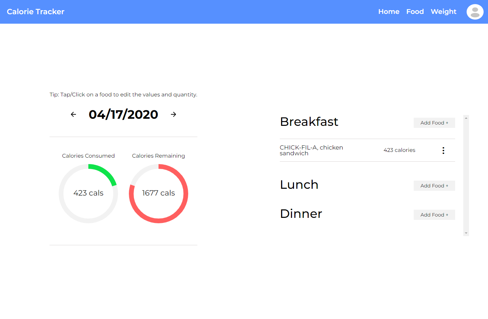

# calorie-tracker
[Calorie Tracker](https://www.calorietracker.site/)

A calorie tracker built with React, Express, PostgreSQL, and the FoodData Central API. Calorie-tracker allows you to track, edit, and delete food. On top of tracking calories, calorie-tracker allows you to set calorie and weight goals to help you keep on track.

## Prerequisites:
###  All sql, and .env.example files will be in a folder called misc.

 1. Run postgres file to create a working dev database.
 2. Have a FoodData Central API Key.
 3. Fill in .env.example variables and copy them over into a .env file in the server folder.

## Instructions to run locally:

    cd server
    
    # Follow pre reqs above to make sure your .env file is correct.
    touch .env
    
    # Install dependencies for server and client.
    npm run fullStackInstall
	
	# Start Dev server on client and server.
	npm run fullStack
	
	# If nessceary, go into client directory and change react proxy.
	cd .. && cd client
	sudo nano package.json
	

## Instructions to build: 

    cd client && npm run build
    # Proceed to copy build folder into server folder.
	
	# Run npm run production in server folder.
	cd .. && npm run production
